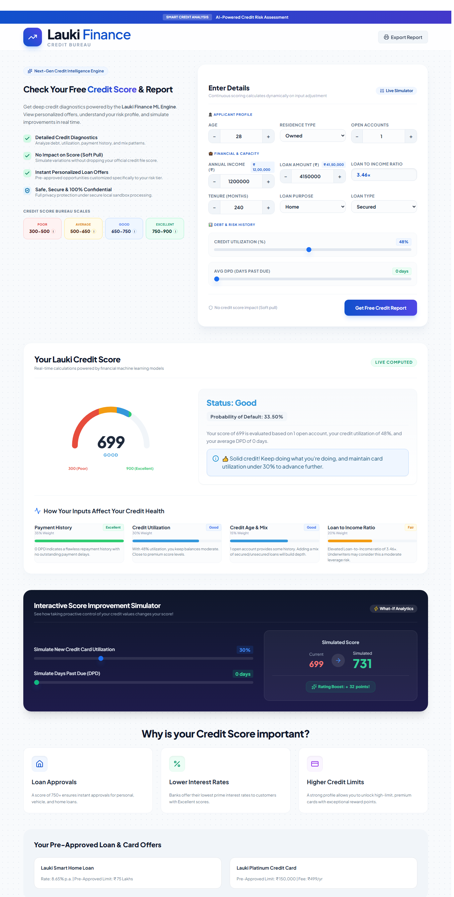

# Lauki Finance: Credit Risk Modeling

## 🚀 Live Demo

Try the Credit Risk Analysis application live:

👉 **[Open Streamlit App](https://data-science-projects-git-j5d4tkchpzplvudgcu7jva.streamlit.app/)**

---

## 📸 Project Preview



---


## Overview

Credit risk is one of the most important challenges in lending. A financial institution needs to understand whether a borrower is likely to repay a loan or default before making a lending decision.

This project develops a **machine learning-based credit risk model** to predict loan default using customer information, loan details, and credit-bureau data.

The project follows a complete credit-risk modeling process, from data preparation and exploratory analysis to feature engineering, feature selection, model tuning, and final model evaluation.

---

## Business Problem

The goal is to identify customers who are more likely to default on their loans.

A reliable credit risk model can help financial institutions:

* Identify high-risk borrowers
* Improve lending decisions
* Reduce potential credit losses
* Prioritize customers for risk monitoring
* Support risk-based lending strategies

The target variable is:

* `0` → No Default
* `1` → Default

---

## Dataset

The project combines three datasets using `cust_id`.

| Dataset     | Records | Description                                  |
| ----------- | ------: | -------------------------------------------- |
| Customers   |  50,000 | Customer demographic and income information  |
| Loans       |  50,000 | Loan amount, tenure and loan-related details |
| Bureau Data |  50,000 | Credit history and repayment behavior        |

After combining the datasets, the final dataset contains **50,000 customers and 33 columns**.

### Target Distribution

| Class      | Customers | Percentage |
| ---------- | --------: | ---------: |
| No Default |    45,703 |     ~91.4% |
| Default    |     4,297 |      ~8.6% |

The relatively small number of default cases makes **class imbalance** an important part of the modeling process.

---

## Project Workflow

```text
Customer Data
      +
Loan Data
      +
Bureau Data
      ↓
Data Integration
      ↓
Train/Test Split
      ↓
Data Cleaning
      ↓
Exploratory Data Analysis
      ↓
Feature Engineering
      ↓
Feature Selection
      ↓
Encoding & Scaling
      ↓
Class Imbalance Handling
      ↓
Model Training
      ↓
Hyperparameter Tuning
      ↓
Model Evaluation
      ↓
Final Credit Risk Model
```

---

## Data Preparation

The first step was to combine the customer, loan, and bureau datasets into a single modeling dataset.

The data was then checked for:

* Missing values
* Duplicate records
* Invalid categories
* Business-rule violations
* Outliers
* Highly correlated variables

### Missing Values

Missing values in `residence_type` were handled using the mode calculated from the training data.

This approach ensures that the same preprocessing logic is used for both training and test data.

### Data Quality Checks

Several business rules were used to validate the data.

For example:

* Processing fee was checked against loan amount
* GST values were validated
* Net disbursement was checked against loan amount
* Inconsistent values in `loan_purpose` were corrected

The category `Personaal` was corrected to `Personal`.

---

## Exploratory Data Analysis

EDA was performed to understand how customer, loan, and credit behavior differ between default and non-default customers.

Some of the important variables analyzed were:

* Age
* Loan tenure
* Credit utilization
* Delinquent months
* Total DPD
* Number of open accounts
* Loan purpose
* Loan type

One noticeable pattern was that the default group was younger on average.

```text
Average age of defaulters     ≈ 37.12 years
Average age of non-defaulters ≈ 39.70 years
```

Credit behavior also showed clear differences between default and non-default customers.

---

## Feature Engineering

Three domain-based features were created to capture borrower risk more effectively.

### 1. Loan-to-Income Ratio

```python
loan_to_income = loan_amount / income
```

This measures the loan size relative to the customer's income.

A higher value indicates greater borrowing relative to income and is associated with higher observed risk.

### 2. Delinquency Ratio

```python
delinquency_ratio = (
    delinquent_months * 100 / total_loan_months
)
```

This represents the percentage of loan months during which the borrower was delinquent.

### 3. Average DPD per Delinquency

```python
avg_dpd_per_delinquency = total_dpd / delinquent_months
```

This captures the average number of days past due during delinquent periods.

These engineered variables provide more meaningful risk signals than relying only on the original raw variables.

---

## Feature Selection

After feature engineering, multicollinearity was checked using **Variance Inflation Factor (VIF)**.

Highly correlated variables such as:

* `sanction_amount`
* `processing_fee`
* `gst`
* `net_disbursement`
* `principal_outstanding`

were removed to improve model stability.

### Information Value

Because this is a credit-risk problem, **Weight of Evidence (WOE)** and **Information Value (IV)** were also used to measure feature strength.

The strongest features included:

| Feature                     |    IV |
| --------------------------- | ----: |
| Credit Utilization Ratio    | 2.353 |
| Delinquency Ratio           | 0.717 |
| Loan-to-Income              | 0.476 |
| Average DPD per Delinquency | 0.402 |
| Loan Purpose                | 0.369 |
| Residence Type              | 0.247 |
| Loan Tenure                 | 0.219 |
| Loan Type                   | 0.163 |
| Age                         | 0.089 |
| Number of Open Accounts     | 0.085 |

Features with **IV > 0.02** were selected for the final modeling dataset.

---

## Features Used in the Final Model

The selected variables were:

```text
age
residence_type
loan_purpose
loan_type
loan_tenure_months
number_of_open_accounts
credit_utilization_ratio
loan_to_income
delinquency_ratio
avg_dpd_per_delinquency
```

These features capture a combination of:

* Customer profile
* Loan characteristics
* Credit utilization
* Repayment behavior
* Borrowing capacity

---

## Handling Class Imbalance

Since only about **8.6% of customers are defaulters**, simply maximizing accuracy could result in a model that performs well on the majority class while missing risky customers.

Different approaches were therefore evaluated.

### Random Undersampling

The majority class was reduced to match the minority class.

After undersampling:

```text
Default       → 3,223
Non-default   → 3,223
```

This improved class balance but reduced overall model performance.

### SMOTE + Tomek Links

The project also tested:

```python
SMOTETomek(random_state=42)
```

This combines synthetic oversampling of the minority class with Tomek-link cleaning.

The resulting training set became balanced:

```text
Default       → 34,195
Non-default   → 34,195
```

This approach provided a better balance between identifying default cases and maintaining overall performance.

---

## Models Evaluated

Three major machine learning algorithms were tested:

* Logistic Regression
* Random Forest
* XGBoost

The initial models produced approximately:

| Model               | Accuracy |       F1 |
| ------------------- | -------: |---------:|
| Logistic Regression |     0.96 |     0.88 |
| Random Forest       |     0.96 |     0.88 |
| XGBoost             |     0.96 |     0.88 |

Because the dataset is imbalanced, additional evaluation metrics were considered instead of relying only on accuracy.

---

## Hyperparameter Optimization

**Optuna** was used to improve model performance.

### Logistic Regression

The following parameters were optimized:

* `C`
* `solver`
* `tol`
* `class_weight`

The optimization used:

```text
50 trials
3-fold cross-validation
F1 as the optimization metric
```

Best cross-validation F1:

```text
0.9463
```

### XGBoost

XGBoost was also optimized using Optuna with parameters such as:

* `max_depth`
* `eta`
* `gamma`
* `subsample`
* `colsample_bytree`
* `min_child_weight`
* `scale_pos_weight`

Best cross-validation F1:

```text
0.9761
```

Although tuned XGBoost performed strongly during optimization, the final project uses **Logistic Regression** because it offers better interpretability for a credit-risk use case.

---

## Final Model

The final model selected is:

**Logistic Regression**

The model was chosen because credit-risk models often need to be understandable and explainable to business and risk teams.

The final model artifact stores:

* Trained model
* Feature names
* Scaler
* Columns requiring scaling

and is saved using `joblib`.

---

## Final Model Performance

On the held-out test set:

| Metric      |      Score |
|-------------|-----------:|
| Accuracy    |        93% |
| Precision   |       0.78 |
| Recall      |       0.94 |
| F1          |       0.83 |
| Weighted F1 |       0.94 |
| ROC-AUC     | **0.9837** |
| Gini        | **0.9673** |
| Maximum KS  | **85.98%** |

The final test dataset contains **12,497 observations**.

---

## Why ROC-AUC, KS and Gini Matter

For credit-risk modeling, accuracy alone does not tell the complete story.

### ROC-AUC

The final model achieves:

```text
ROC-AUC = 0.9837
```

This indicates strong separation between default and non-default customers.

### Gini

The Gini coefficient is calculated from AUC:

```text
Gini = 2 × AUC - 1
```

Result:

```text
Gini = 0.9673
```

### KS Statistic

The maximum KS statistic is:

```text
85.98%
```

The model shows strong separation between risky and lower-risk customers when borrowers are ranked according to predicted default probability.

---

## Important Business Insights

The analysis identified several meaningful risk patterns.

### Credit Utilization

Credit utilization was the strongest feature according to Information Value.

Higher credit utilization is associated with greater observed default risk.

### Loan-to-Income

Customers with larger loans relative to income tend to show higher risk.

### Delinquency

Delinquency-related variables are among the strongest predictors in the dataset.

Both:

* Delinquency Ratio
* Average DPD per Delinquency

provide strong signals of repayment risk.

### Age

The default population is younger on average than the non-default population.

### Loan Characteristics

Loan purpose, loan type, and loan tenure also contribute to predicting default risk.

---

## Tech Stack

**Language**

* Python

**Data Analysis**

* Pandas
* NumPy

**Visualization**

* Matplotlib
* Seaborn

**Machine Learning**

* Scikit-learn
* XGBoost

**Imbalanced Data**

* imbalanced-learn
* SMOTE
* Tomek Links

**Statistical Analysis**

* Statsmodels
* VIF
* WOE
* Information Value

**Optimization**

* Optuna
* RandomizedSearchCV

**Model Persistence**

* Joblib

---

## Project Structure

```text
Credit-Risk-Modeling/
│
├── dataset/
│   ├── customers.csv
│   ├── loans.csv
│   └── bureau_data.csv
│
├── artifacts/
│   └── model_data.joblib
│
├── credit_risk_model.ipynb
│
└── README.md
```


---

## Key Results

```text
Customers                 50,000
Default Rate              ~8.6%

Final Model               Logistic Regression

Accuracy                  93%
F1                        0.83
ROC-AUC                   0.9837
Gini                      0.9673
Maximum KS                85.98%
```

---


## Conclusion

This project demonstrates a complete **credit-risk modeling workflow**, rather than simply training a classification algorithm.

It combines:

* Multiple data sources
* Business-rule validation
* Exploratory data analysis
* Credit-focused feature engineering
* VIF-based multicollinearity analysis
* WOE/IV feature selection
* Class-imbalance handling
* Multiple machine learning models
* Optuna hyperparameter tuning
* Credit-risk evaluation using ROC-AUC, KS and Gini
* Model persistence for future inference

