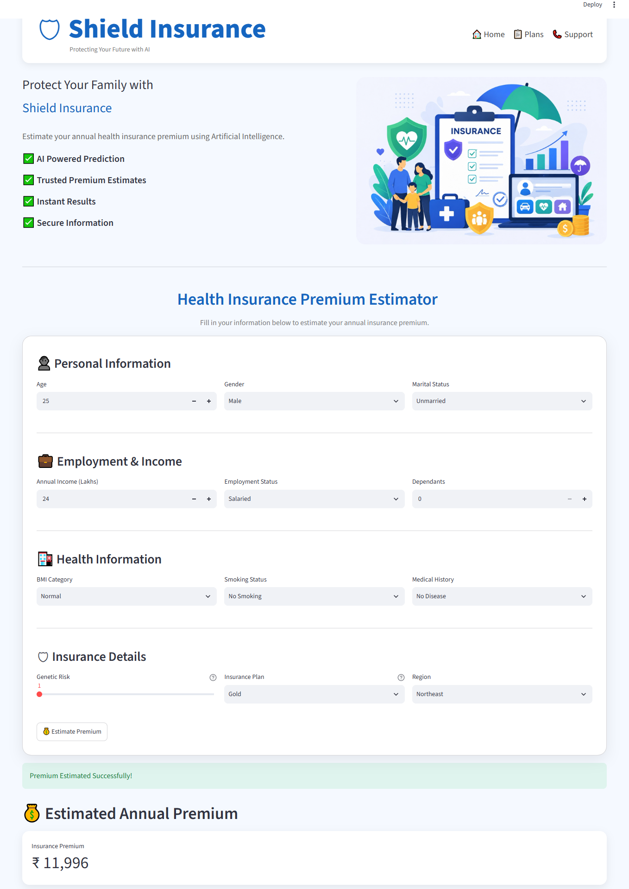

# 🏥 Health Insurance Premium Prediction

## 📌 Project Overview

Health insurance premiums depend on several factors such as **age, BMI, smoking habits, income, medical history, and lifestyle**. This project develops a Machine Learning solution to predict annual insurance premiums accurately and deploys the model through a **Streamlit** web application for real-time premium estimation. 


## 🚀 Live Demo

Try the deployed Streamlit application here:

**🌐 Live App:** https://your-streamlit-app.streamlit.app

The application allows you to:

* Enter customer details such as age, BMI, smoking status, income, and medical history.
* Predict the annual health insurance premium in real time.
* Experience the deployed Machine Learning model without any local setup.

>  Feel free to test different customer profiles and compare how changes in features (e.g., smoking status, age, or insurance plan) affect the predicted premium.

---

## 📷 Demo




---

## ❓ Problem Statement

Calculating health insurance premiums manually is a challenging task because it depends on multiple customer attributes.

Some of the major challenges are:

* Premium calculation depends on many factors such as age, BMI, income, smoking habits, medical history, and insurance plan.
* Manual estimation is time-consuming and prone to human errors.
* Different underwriters may produce inconsistent premium estimates.
* Insurance companies require a faster, more accurate, and automated prediction system.

This project addresses these challenges by building a Machine Learning model that predicts insurance premiums automatically. 

---

## 🎯 Business Objective

The objectives of this project are:

* Build a Machine Learning model with **greater than 97% prediction accuracy**.
* Ensure **95% of predictions** have an error of less than **10%**.
* Reduce manual effort in premium calculation.
* Improve consistency and reliability in premium estimation.
* Deploy the trained model using **Streamlit** for real-time prediction.
* Support insurance underwriters in making faster decisions. 

---

## 📊 Dataset Overview

| Metric            |                     Value |
| ----------------- | ------------------------: |
| Total Records     |                **50,000** |
| Young Dataset     |        **20,096 Records** |
| Rest Dataset      |        **29,904 Records** |
| Original Features |                    **14** |
| Target Variable   |     Annual Premium Amount |
| Age Groups        | 18–25 Years & 26–72 Years |


---

## 🛠 Tech Stack

* Python
* Pandas
* NumPy
* Matplotlib
* Scikit-learn
* XGBoost
* Joblib
* Streamlit

---

## 🔄 Project Workflow

```text
Raw Data
    │
    ▼
Data Cleaning
    │
    ▼
Exploratory Data Analysis (EDA)
    │
    ▼
Feature Engineering
    │
    ▼
Encoding & Feature Scaling
    │
    ▼
Multicollinearity Check (VIF)
    │
    ▼
Model Training
    │
    ▼
Hyperparameter Tuning
    │
    ▼
Model Evaluation
    │
    ▼
Save Best Model
    │
    ▼
Streamlit Deployment
```


---

## 📈 Project Insights

## 1️⃣ Data Cleaning

| Step                     |      Young |       Rest |
| ------------------------ | ---------: | ---------: |
| Original Records         |     20,096 |     29,904 |
| Missing Rows Removed     |          6 |         18 |
| Duplicate Rows           |          0 |          0 |
| Invalid Dependants Fixed |        Yes |        Yes |
| Age Outliers Removed     |          0 |         58 |
| Income Outliers Removed  |          4 |          6 |
| Final Dataset            | **20,086** | **29,822** |

**Insight:** Less than **0.1%** of records contained missing values, indicating a high-quality dataset.  

---

## 2️⃣ Feature Engineering

* Medical history converted into **Risk Score**
* Insurance Plan → Ordinal Encoding
* Income Level → Ordinal Encoding
* Six categorical features → One-Hot Encoding
* Final training dataset contained **18 features**

 

---

## 3️⃣ Feature Selection (VIF)

| Metric              |          Value |
| ------------------- | -------------: |
| Highest Initial VIF |      **13.89** |
| Removed Feature     | `income_level` |
| Final Maximum VIF   |    Below **5** |

**Insight:** Removing `income_level` reduced multicollinearity and improved model stability. 

---

## 4️⃣ Train-Test Split

| Dataset | Training | Testing |
| ------- | -------: | ------: |
| Young   |   14,060 |   6,026 |
| Rest    |   20,875 |   8,947 |

Training Ratio: **70%**

Testing Ratio: **30%**


---

## 5️⃣ Model Performance

| Model             | Young Dataset |  Rest Dataset |
| ----------------- | ------------: | ------------: |
| Linear Regression | **98.87% R²** |     95.38% R² |
| Ridge Regression  |             — |     95.38% R² |
| Tuned XGBoost     |     98.79% R² | **99.71% R²** |

### Selected Models

| Dataset | Final Model         |
| ------- | ------------------- |
| Young   | ✅ Linear Regression |
| Rest    | ✅ Tuned XGBoost     |

**Insight**

* Linear Regression performed best for the **Young** dataset.
* Tuned XGBoost achieved the highest accuracy for the **Rest** dataset.


---

## 6️⃣ Prediction Accuracy

| Metric                      |  Young |    Rest |
| --------------------------- | -----: | ------: |
| Test R²                     | 98.87% | 99.71%* |
| Predictions with >10% Error |  2.14% |   0.32% |

*Best tuned XGBoost CV score.

**Insight:** More than **97%** of predictions closely matched the actual insurance premium. 

---

## 7️⃣ Important Features

### Young Customers (18–25)

1. Smoking Status
2. Insurance Plan
3. Income
4. Medical Risk Score

### Rest Customers (26–72)

1. Smoking Status
2. Age
3. Insurance Plan
4. Income

**Key Finding:** Smoking status is the strongest factor influencing premium prediction in both age groups. 

---

## 📦 Deployment

The trained models and preprocessing objects were saved using **Joblib**.

* `model_young.joblib`
* `model_rest.joblib`
* `scaler_young.joblib`
* `scaler_rest.joblib`

The final application was deployed using **Streamlit** for real-time premium prediction. 

---

## 📌 Final Project Summary

| Category             |             Value |
| -------------------- | ----------------: |
| Total Records        |        **50,000** |
| Final Records Used   |        **49,908** |
| Features Used        |            **18** |
| Models Compared      |             **3** |
| Best Accuracy        |     **99.71% R²** |
| Best Young Model     | Linear Regression |
| Best Rest Model      |     Tuned XGBoost |
| Deployment Framework |         Streamlit |
| Model Serialization  |            Joblib |

---

## 📚 Key Learning Outcomes

By completing this project, students will learn:

* Data Cleaning
* Exploratory Data Analysis (EDA)
* Feature Engineering
* Encoding Techniques
* Feature Scaling
* Multicollinearity (VIF)
* Linear Regression
* Ridge Regression
* XGBoost
* Hyperparameter Tuning
* Model Evaluation
* Model Deployment using Streamlit

---

## ⭐ Conclusion

This project demonstrates an end-to-end Machine Learning workflow—from data preprocessing and feature engineering to model selection and deployment. By comparing multiple regression algorithms, the project achieved **99.71% R²** on the older age group using **Tuned XGBoost** and **98.87% R²** on the younger age group using **Linear Regression**, highlighting that selecting the right model for the data is more important than choosing the most complex algorithm.
