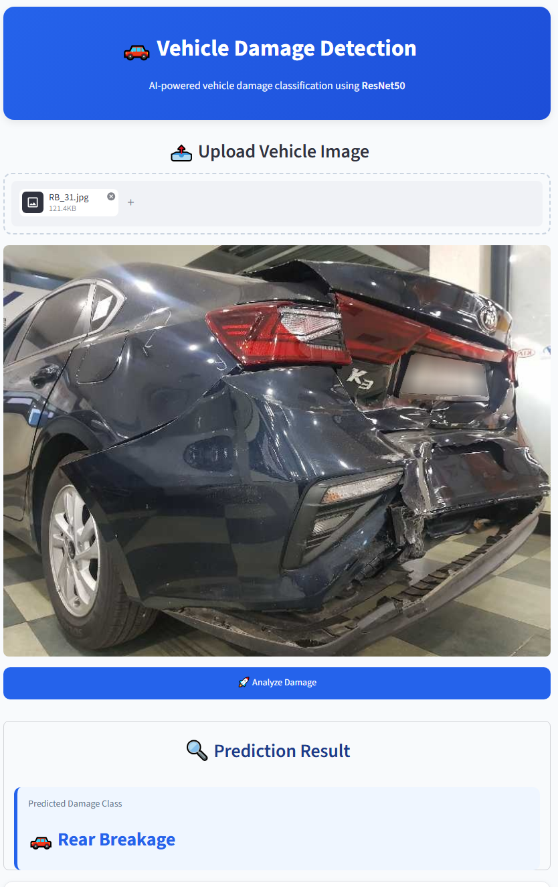

# 🚗 Vehicle Damage Detection App

This application uses **Streamlit** and **Deep Learning (ResNet50)** to detect the type of damage in a car from an uploaded image.


Simply upload an image of a car, and the model predicts the damage category.




---

## Model Details

- **Model:** ResNet50 (Transfer Learning)
- **Training Images:** Approximately 2,300
- **Number of Classes:** 6

### Damage Classes

- Front Normal
- Front Crushed
- Front Breakage
- Rear Normal
- Rear Crushed
- Rear Breakage

### Model Performance

- **Validation Accuracy:** ~80%

---

## Installation

Install the required dependencies:

```bash
pip install -r requirements.txt
```

---

## Run the Application

Start the Streamlit application:

```bash
streamlit run app.py
```

The application will open in your default web browser.

---

## Technologies Used

- Python
- Streamlit
- PyTorch
- Torchvision
- ResNet50
- Pillow

---

## Project Workflow

1. Upload a car image.
2. The image is preprocessed.
3. The trained ResNet50 model predicts the damage category.
4. The predicted damage type is displayed on the screen.

---

## Notes

- Upload clear, high-quality images.
- Best results are obtained with third-quarter front or rear views.
- Performance may decrease for side views, top views, or heavily occluded vehicles.