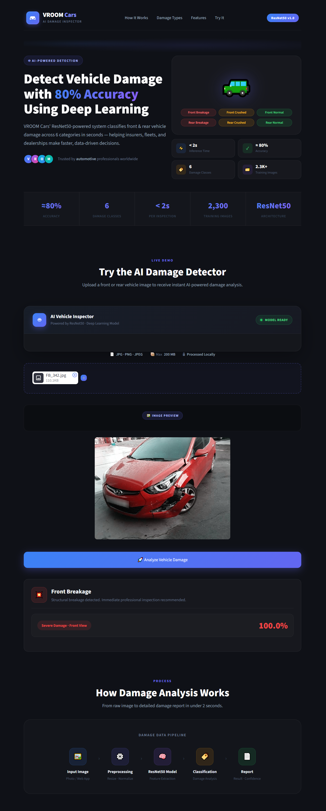

# 🚗 Vehicle Damage Detection

<p align="center">

### Deep Learning  • Transfer Learning • Streamlit

A Proof of Concept for automated vehicle damage classification using deep learning.

</p>

---
## 📌 Project Overview

**Vehicle Damage Detection** is a deep learning Proof of Concept (POC) designed to classify vehicle images into six predefined categories based on:

- Vehicle position — **Front / Rear**
- Vehicle condition — **Normal / Breakage / Crushed**

The project was developed to evaluate the feasibility of an automated vehicle damage detection system.

The final solution uses **ResNet50 Transfer Learning** and integrates the trained model with a **Streamlit web application** for image-based prediction.


---

## 🚀 Live Demo

👉 **[Try Vehicle Damage Detection App]([YOUR_STREAMLIT_APP_URL](https://data-science-projects-5c24mnpbf8v6ay5tel2ixn.streamlit.app/))**

> Upload a vehicle image and get an AI-powered damage classification.

---

### Project Goal

The system should:

- Accept an uploaded vehicle image.
- Identify the vehicle's visible position.
- Identify the vehicle's damage condition.
- Return one of six predefined classes.
- Achieve at least **75% classification accuracy**.

---

# 🎯 Business Problem

Manual vehicle inspection can be time-consuming and may introduce inconsistencies between inspections.

An automated computer vision system can assist by analyzing vehicle images and identifying the visible condition of the vehicle.

The objective of this POC is to determine whether deep learning can be used to automatically classify vehicle damage from uploaded images.

---

# 🏷️ Target Classes

The project contains six classification categories.

| Class | Description |
|---|---|
| `F_Normal` | Front of vehicle — Normal |
| `F_Breakage` | Front of vehicle — Breakage |
| `F_Crushed` | Front of vehicle — Crushed |
| `R_Normal` | Rear of vehicle — Normal |
| `R_Breakage` | Rear of vehicle — Breakage |
| `R_Crushed` | Rear of vehicle — Crushed |

---

# 🎯 Project Objectives

The main objectives are:

- Build a vehicle damage classification model.
- Classify images into six predefined categories.
- Explore multiple deep learning architectures.
- Apply image preprocessing and augmentation.
- Apply transfer learning.
- Compare model performance.
- Perform hyperparameter tuning.
- Evaluate the final model using multiple metrics.
- Save the trained model.
- Build a Streamlit prediction application.
- Achieve the required accuracy target of **75%+**.

---

# 📊 Dataset

The project uses an image classification dataset containing:

| Dataset Information | Value |
|---|---:|
| Total Images | 2,300 |
| Training Images | 1,725 |
| Validation Images | 575 |
| Training Split | 75% |
| Validation Split | 25% |
| Number of Classes | 6 |
| Input Image Size | `224 × 224` |


---

# 🖼️ Image Preprocessing

Images are transformed into a consistent format before being passed to the deep learning models.

## Training Augmentation

The training pipeline includes:

- Random horizontal flip
- Random rotation
- Color jitter
- Image resizing
- Tensor conversion
- ImageNet normalization

```python
transforms.Compose([
    transforms.RandomHorizontalFlip(),
    transforms.RandomRotation(10),
    transforms.ColorJitter(
        brightness=0.2,
        contrast=0.2
    ),
    transforms.Resize((224, 224)),
    transforms.ToTensor(),
    transforms.Normalize(
        mean=[0.485, 0.456, 0.406],
        std=[0.229, 0.224, 0.225]
    )
])
```

### Why Augmentation?

Data augmentation helps the model become more robust to variations in:

- Image orientation
- Lighting
- Camera angle
- Vehicle position
- Image quality
- Background conditions

---

# 🧠 Model Development

Multiple deep learning approaches were evaluated during the project.

---

## 1️⃣ Custom CNN

A custom Convolutional Neural Network was developed as a baseline model.

### Result

**Validation Accuracy: 57.74%**

The baseline model demonstrated that the dataset could be learned using a custom CNN, but the result was below the required 75% target.

---

## 2️⃣ CNN with Regularization

The CNN was further experimented with using regularization techniques including:

- Batch Normalization
- Dropout
- Weight Decay

### Result

**Validation Accuracy: 50.43%**

This configuration did not improve the baseline performance.

---

## 3️⃣ EfficientNet-B0

A pretrained **EfficientNet-B0** model was evaluated using transfer learning.

The pretrained model was adapted for the six-class classification problem.

### Result

**Validation Accuracy: 66.78%**

Although this approach improved the model architecture, the result remained below the required 75% target.

---

# 🏆 Final Model — ResNet50

The final approach uses a pretrained **ResNet50** architecture.

Transfer learning was selected because pretrained image representations can provide strong visual features for image classification.

## ResNet50 Configuration

The model was configured using:

- Pretrained ResNet50 weights
- Frozen pretrained parameters
- Unfrozen `layer4`
- Custom six-class classification head
- Dropout before the final classification layer

### Final Training Configuration

| Parameter | Value |
|---|---:|
| Model | ResNet50 |
| Pretrained Weights | Yes |
| Trainable Backbone | `layer4` |
| Dropout | `0.2` |
| Learning Rate | `0.005` |
| Optimizer | Adam |
| Loss Function | Cross Entropy |
| Epochs | 10 |
| Batch Size | 32 |
| Output Classes | 6 |

---

# 🔎 Hyperparameter Tuning

**Optuna** was used to investigate suitable hyperparameters for the ResNet50 model.

## Search Space

| Parameter | Search Range |
|---|---|
| Learning Rate | `1e-5` → `1e-2` |
| Dropout | `0.2` → `0.7` |
| Number of Trials | 20 |
| Epochs per Trial | 3 |

Trial pruning was used to stop unpromising trials early.

## Best Recorded Optuna Trial

The best recorded trial achieved approximately:

### **80.17% Validation Accuracy**

with:

```text
Learning Rate = 0.0004266452
Dropout       = 0.6640107
```

The final training experiment subsequently used the selected ResNet50 configuration:

```text
Learning Rate = 0.005
Dropout       = 0.2
Epochs        = 10
```

---

# 📈 Model Comparison

| Model | Validation Accuracy |
|---|---:|
| Custom CNN | 57.74% |
| CNN + Regularization | 50.43% |
| EfficientNet-B0 | 66.78% |
| ResNet50 — Final Run | **79.48%** |


### Model Selection

ResNet50 was selected because the final training run achieved accuracy above the required 75% threshold.

```text
Required Accuracy
       │
       ▼
      75%
       │
       ├──────────────────────────────┐
       │                              │
       ▼                              ▼
 EfficientNet-B0                  ResNet50
     66.78%                        79.48%
                                      │
                                      ▼
                               Target Achieved
```

---

# 🏆 79.48% Validation Accuracy

This exceeds the project's required accuracy target of **75%**.

---

## Classification Report

| Class | Precision | Recall | F1-Score |
|---|---:|---:|---:|
| `F_Breakage` | 0.73 | 0.93 | 0.82 |
| `F_Crushed` | 0.82 | 0.69 | 0.75 |
| `F_Normal` | 0.96 | 0.81 | 0.88 |
| `R_Breakage` | 0.84 | 0.65 | 0.74 |
| `R_Crushed` | 0.70 | 0.71 | 0.71 |
| `R_Normal` | 0.75 | 0.92 | 0.83 |
| **Overall** | **0.81** | **0.79** | **0.79** |

**Validation Samples:** 575

---

# 🔬 Model Workflow

```text
                    Vehicle Image
                          │
                          ▼
                Image Preprocessing
                          │
                ┌─────────┴─────────┐
                │                   │
              Resize             Normalize
             224 × 224            ImageNet
                │                   │
                └─────────┬─────────┘
                          │
                          ▼
                 ResNet50 Backbone
                 Transfer Learning
                          │
                          ▼
                Classification Head
                          │
                          ▼
                  Six-Class Output
                          │
        ┌─────────────────┼─────────────────┐
        │                 │                 │
        ▼                 ▼                 ▼
      Normal          Breakage           Crushed
        │                 │                 │
        └────────────┬────┴────┬────────────┘
                     │         │
                     ▼         ▼
                   Front      Rear
```

---

# 🚀 Streamlit Application

The trained model is integrated into a **Streamlit web application**.

The application allows users to upload a vehicle image and receive the predicted damage category.

## Application Flow

```text
Upload Vehicle Image
        │
        ▼
Image Preprocessing
        │
        ▼
Trained ResNet50 Model
        │
        ▼
Model Prediction
        │
        ▼
Predicted Damage Class
```

## Supported Predictions

- 🚗 Front Normal
- 💥 Front Breakage
- 🔨 Front Crushed
- 🚙 Rear Normal
- 💥 Rear Breakage
- 🔨 Rear Crushed

---

# 🖥️ Application Preview



---

# 📁 Project Structure

```text
Vehicle-Damage-Detection/
│
├── README.md
├── app.py
├── model_helper.py
├── requirments.txt
├── app_screenshot3.png
│
└── model/
    └── saved_model.pth
```

---

# 🧩 Project Components

## `app.py`

Main Streamlit application.

Responsible for:

- Loading the application interface
- Accepting uploaded images
- Running predictions
- Displaying the predicted class

---

## `model_helper.py`

Helper module responsible for model-related functionality such as:

- Loading the trained model
- Image preprocessing
- Prediction processing
- Class mapping

---

## `model/saved_model.pth`

Saved PyTorch model used for inference.

---

## `app_screenshot1.png`

Screenshot showing the Streamlit application interface.

---

# 📓 Project Notebooks

## `damage_prediction.ipynb`

The main model development notebook covers:

1. Dataset loading
2. Dataset exploration
3. Class distribution
4. Image preprocessing
5. Data augmentation
6. Train-validation split
7. Custom CNN
8. CNN with regularization
9. EfficientNet-B0
10. ResNet50
11. Transfer learning
12. Model training
13. Model evaluation
14. Classification report
15. Confusion matrix
16. Model saving

---

## `hyperparameter_tunning.ipynb`

The hyperparameter optimization notebook covers:

1. ResNet50 configuration
2. Optuna integration
3. Search-space definition
4. Learning-rate optimization
5. Dropout optimization
6. Multiple optimization trials
7. Trial pruning
8. Best-trial selection

---

# 🛠️ Technologies Used

| Technology | Purpose |
|---|---|
| Python | Programming Language |
| PyTorch | Deep Learning |
| Torchvision | Computer Vision |
| ResNet50 | Final Classification Model |
| EfficientNet-B0 | Transfer Learning Experiment |
| Optuna | Hyperparameter Optimization |
| Scikit-learn | Model Evaluation |
| NumPy | Numerical Computing |
| Matplotlib | Visualization |
| Streamlit | Web Application |


---

# ▶️ Run the Application

From the project directory:

```bash
streamlit run app.py
```

The application will normally be available at:

```text
http://localhost:8501
```

Open the URL in your browser.

---

# 🚀 Deployment

The project is designed to run as a Streamlit application.

The deployment requires:

```text
app.py
model_helper.py
model/saved_model.pth
requirments.txt
```

Make sure all required model files and dependencies are committed to the repository before deployment.

---

# 📋 Project Deliverables

The project requirements include:

- ✅ Trained vehicle damage detection model
- ✅ Source code
- ✅ Accuracy greater than 75%
- ✅ Streamlit application
- ✅ Image upload capability
- ✅ Six-class prediction output

### Final Status

| Requirement | Status |
|---|---|
| Trained Model | ✅ Completed |
| Source Code | ✅ Completed |
| 75%+ Accuracy | ✅ Achieved |
| Streamlit App | ✅ Completed |
| Six-Class Prediction | ✅ Completed |

---

# ⚠️ Limitations

This project is a **Proof of Concept (POC)** and should not be considered a production-grade vehicle inspection system.

Performance can vary depending on:

- Image quality
- Lighting conditions
- Camera angle
- Vehicle type
- Damage severity
- Background conditions
- Image composition
- Similarity between real-world images and training data

The reported performance is based on the validation dataset used during model development.

---

# 🔮 Future Improvements

Potential improvements include:

- 📸 Increase the size and diversity of the dataset
- ⚖️ Address class imbalance
- 🔄 Improve image augmentation
- 🧠 Fine-tune additional ResNet50 layers
- 🔬 Perform cross-validation
- 🎯 Perform more extensive hyperparameter optimization
- 📊 Add prediction confidence scores
- 🚫 Detect unsupported or out-of-distribution images
- 🏷️ Add damage localization
- 🔍 Detect multiple damaged areas in one image
- 🌐 Build a production-ready inference API
- 📈 Add model monitoring
- ☁️ Deploy using scalable cloud infrastructure

---

# 📌 End-to-End Project Pipeline

```text
┌────────────────────────┐
│    Vehicle Dataset     │
└────────────┬───────────┘
             │
             ▼
┌────────────────────────┐
│   Data Exploration     │
└────────────┬───────────┘
             │
             ▼
┌────────────────────────┐
│ Preprocessing &        │
│ Data Augmentation      │
└────────────┬───────────┘
             │
             ▼
┌────────────────────────┐
│    CNN Experiments     │
└────────────┬───────────┘
             │
             ▼
┌────────────────────────┐
│  Transfer Learning     │
│ EfficientNet / ResNet  │
└────────────┬───────────┘
             │
             ▼
┌────────────────────────┐
│ Hyperparameter Tuning  │
│       with Optuna      │
└────────────┬───────────┘
             │
             ▼
┌────────────────────────┐
│    Final ResNet50      │
│    79.48% Accuracy     │
└────────────┬───────────┘
             │
             ▼
┌────────────────────────┐
│    Model Evaluation    │
└────────────┬───────────┘
             │
             ▼
┌────────────────────────┐
│    Save Model          │
└────────────┬───────────┘
             │
             ▼
┌────────────────────────┐
│ Streamlit Application  │
└────────────────────────┘
```

---

# 🏆 Key Results

| Metric | Result |
|---|---:|
| Total Images | 2,300 |
| Training Images | 1,725 |
| Validation Images | 575 |
| Number of Classes | 6 |
| Required Accuracy | 75% |
| Custom CNN Accuracy | 57.74% |
| CNN + Regularization | 50.43% |
| EfficientNet-B0 | 66.78% |
| Final ResNet50 Accuracy | **79.48%** |
| Best Recorded Optuna Trial | **~80.17%** |

---

# 💡 Key Learning Outcomes

This project demonstrates practical experience with:


- Image Classification
- Convolutional Neural Networks
- Transfer Learning
- ResNet50
- EfficientNet-B0
- Data Augmentation
- Model Comparison
- Hyperparameter Optimization
- Optuna
- Classification Metrics
- Confusion Matrix Analysis
- PyTorch
- Model Serialization
- Streamlit Deployment

---

# 👨‍💻 Author

**Uttam Vardam**

Data Science • Machine Learning • Deep Learning 

---

## ⭐ Support This Project

If you find this project useful, consider giving the repository a ⭐ on GitHub. Your support is greatly appreciated!
